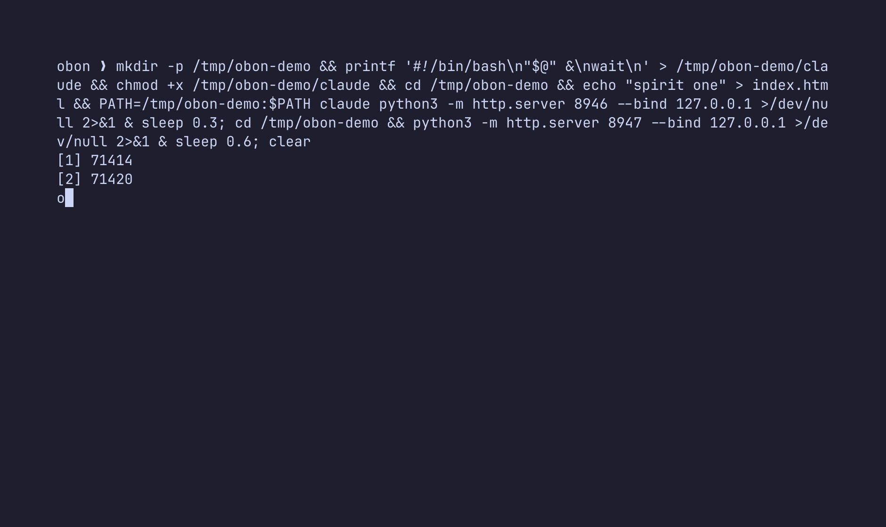

# obon

<p align="center">
  
</p>

**obon is a terminal UI for the ports on your machine: it shows every
process listening on a local port, who started it, whether it is safe to
kill, and kills it for you when you say so.**

Your AI agents summon dev servers and never dismiss them. Claude Code,
Codex, Cursor and friends start `vite`, `next`, `python3 -m http.server`,
and when the session ends the servers stay. Days later your port 3000 is
taken by a ghost you can't name. obon names it: what is on each port, which
agent lit it (parent process chain up to launchd/init), what happens if you
kill it, and one keypress to send it off.

The name comes from Obon (お盆), the Japanese festival in which the spirits
of ancestors return home for a few days and, at its close, are guided away
with paper lanterns floated down the river: tōrō nagashi.

## Safety verdicts

Not everything on a port is a forgotten dev server. Each row carries a
verdict in the SAFE column, and the detail panel (`enter`) explains the
consequence in plain words before you commit:

| pill | verdict | what sending it off means |
|---|---|---|
| `dev` | dev server / agent-lit | only that server stops; restart it any time |
| `app` | part of a desktop app | the app may lose a feature or crash (Docker takes its containers with it) |
| `sys` | OS daemon | a macOS feature drops (Handoff, AirDrop, …); launchd usually relights it |
| `?` | unrecognised | check the detail panel first |

The verdict comes from honest heuristics: known daemon names, binary path
(`/System`, `/usr/libexec`, …), owner (root/`_daemon` users), `.app` bundles,
agent origin and working directory. The confirm dialog sums it up before any
signal is sent, and `obon kill`/`obon clean` print the same warnings; `obon
list --json` carries a `safety` object per process.

For dev servers the detail panel also shows `http://localhost:<port>` as a
clickable link (OSC 8: iTerm2, Ghostty, WezTerm, Kitty) and knocks on the
door for you: a quick probe reports status, content type and the page title
(`200 · text/html · «My App»`), so you can see what is living on a port
before deciding its fate. `o` opens the URL in your browser from the board
or the detail panel.

## Install

```sh
go install github.com/GH-Jaider/obon@latest
# or
brew tap GH-Jaider/homebrew-obon
brew install obon
```

Requires macOS or Linux; Windows builds best-effort.

## Usage

```sh
obon                       # the lantern board (TUI)
obon list                  # one shot table
obon list --json           # machine-readable
obon kill 3000 8123        # send off by port or pid (asks first; -y skips)
obon clean --older-than 2h # decant listeners younger than 2h
```

`clean` is named after tōrō nagashi: anything still burning that was lit less
than `<duration>` ago is guided downstream.

## TUI keys

| key | action |
|---|---|
| `j`/`k`, arrows | move |
| `g`/`G`, pgup/pgdn | top/bottom, page |
| `enter` | detail panel: full command, cwd, parent chain tree, all sockets |
| `o` | open `http://localhost:<port>` in your browser (TCP rows) |
| `space` | toggle selection |
| `a` / `A` | select all visible / clear selection |
| `x` | send off selection (or cursor row) |
| `/` | filter: port, process, cmdline, cwd, origin, user, safety (regex if valid) |
| `s` / `S` | cycle sort column (port → safety → uptime → …) / flip direction |
| `r` | rescan now |
| `esc` | clear selection, then filter |
| `?` | full help |
| `q` | quit |

The board refreshes every 2s (configurable). Your cursor follows its row by
identity across refreshes; rows that just appeared hold a brief warm highlight
before settling; rows that disappeared drift away dimmed for one cycle before
being removed.

A `*` after PROTO means the socket is bound to all interfaces (`0.0.0.0`/`::`),
not just loopback. The ORIGIN column names the agent ancestor that spawned the
process (`claude`, `codex`, `code`, …) or `manual`.

## Configuration

`~/.config/obon/config.json`:

```json
{
  "interval_s": 2,
  "agents": ["claude", "codex", "cursor", "code", "aider", "gemini", "tmux", "ssh"]
}
```

## Design notes

- **Data**: `internal/scan` uses [gopsutil](https://github.com/shirou/gopsutil)
  only, no shelling out to `lsof`/`ss`. On Linux it reads `/proc` natively;
  on macOS gopsutil itself delegates to `lsof` under the hood (documented
  upstream behaviour), which means PID resolution works unprivileged.
- **Send off**: SIGTERM first, SIGKILL after a grace period, then a live probe
  confirms the port actually answered.
- **Privacy**: the TUI never displays environment variables.
- **Metaphor budget**: the lantern lives in the accent colour, the appear and
  disappear transitions, the confirmation copy and this README. Column headers
  say PORT, not SPIRITS.
- **Demo**: recorded with [foley](https://github.com/GH-Jaider/foley), the tape
  lives in `demo/demo.tape`.

## Development

```sh
make check test   # vet + staticcheck + tests
make build        # ./bin/obon
make release      # goreleaser snapshot
```

Releases are cut with [goreleaser](https://goreleaser.com); the Homebrew tap
formula targets `GH-Jaider/homebrew-obon`.

## License

MIT
